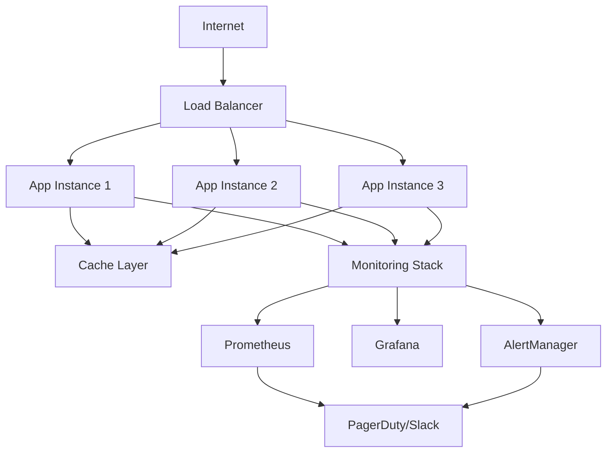

# 🚀 Deployment Guide - EU to USA Data Pipeline

## Overview

This guide covers deploying the EU to USA Data Pipeline to production using Deno Deploy with comprehensive CI/CD, monitoring, and operational practices.

## Prerequisites

- **Deno 2.0+** installed locally
- **GitHub account** with repository access
- **Deno Deploy account** and project setup
- **Domain name** (optional, for custom domains)

## Environment Setup

### 1. Deno Deploy Configuration

#### Create Projects:
```bash
# Staging environment
deployctl project create data-pipelines-staging

# Production environment  
deployctl project create data-pipelines-prod
```

#### Configure Environment Variables:
```bash
# Set environment variables in Deno Deploy dashboard
ENVIRONMENT=production
LOG_LEVEL=info
ENABLE_METRICS=true
CACHE_TTL=300
```

### 2. GitHub Secrets Configuration

Required secrets in GitHub repository settings:

```bash
DENO_DEPLOY_TOKEN=<your-deploy-token>
CODECOV_TOKEN=<your-codecov-token>
```

## CI/CD Pipeline

### Workflow Overview

Our GitHub Actions pipeline includes:

1. **Quality Checks**
   - Code formatting (`deno fmt`)
   - Linting (`deno lint`)  
   - Type checking (`deno check`)
   - SATD comment detection

2. **Testing**
   - Unit tests with coverage
   - Integration tests
   - Performance benchmarks

3. **Security Scanning**
   - Dependency vulnerability checks
   - Secret detection
   - Semgrep security analysis

4. **Build & Deploy**
   - Compile application
   - Deploy to staging/production
   - Health checks and smoke tests

### Deployment Branches

- **`develop`** → Deploys to **staging**
- **`main`** → Deploys to **production**

### Quality Gates

All deployments must pass:
- ✅ 80%+ test coverage
- ✅ Zero SATD comments
- ✅ All security checks
- ✅ Performance benchmarks under thresholds

## Infrastructure Architecture



## Monitoring & Alerting

### Metrics Collection

The application exposes Prometheus metrics at `/metrics`:

- **HTTP metrics**: Request count, duration, error rates
- **Business metrics**: Conversion rates by type
- **System metrics**: Memory, CPU, uptime
- **Resilience metrics**: Circuit breaker states, retry counts

### Key SLIs/SLOs

| Service Level Indicator | Service Level Objective |
|------------------------|------------------------|
| Availability | 99.9% uptime |
| Latency | 95% of requests < 100ms |
| Error Rate | < 1% 5xx errors |
| Throughput | Support 10K req/sec |

### Alert Rules

Critical alerts for:
- Service downtime (30s threshold)
- Error rate > 5% (2min threshold)  
- Response time > 2s (3min threshold)
- Circuit breakers open (1min threshold)
- Memory usage > 80% (5min threshold)

## Performance Testing

### Load Testing

```bash
# Install k6 for load testing
curl https://github.com/grafana/k6/releases/download/v0.45.0/k6-v0.45.0-linux-amd64.tar.gz -L | tar xvz --strip-components 1

# Run performance tests
deno task test:performance
```

### Benchmarking Thresholds

- **P50 latency**: < 50ms
- **P95 latency**: < 100ms  
- **P99 latency**: < 200ms
- **Throughput**: > 1000 RPS
- **Error rate**: < 0.1%

## Health Checks

### Endpoints

- **`/health`** - Basic health status
- **`/ready`** - Readiness probe for K8s/containers
- **`/metrics`** - Prometheus metrics
- **`/version`** - Build and version info

### Health Check Response
```json
{
  "status": "healthy",
  "timestamp": "2025-08-24T10:00:00Z",
  "version": "1.0.0",
  "environment": "production",
  "uptime": 86400.5,
  "services": {
    "cache": "available",
    "metrics": "available", 
    "circuitBreakers": "available",
    "dlq": "available"
  }
}
```

## Operational Runbooks

### Common Issues

#### 1. Service Downtime
```bash
# Check service status
curl https://data-pipelines-prod.deno.dev/health

# View logs in Deno Deploy dashboard
# Check recent deployments
# Verify DNS resolution

# Rollback if needed
deployctl deploy --project=data-pipelines-prod --prod ./src/main.ts
```

#### 2. High Error Rate
```bash
# Check error patterns
curl https://data-pipelines-prod.deno.dev/metrics | grep error

# Review application logs
# Check circuit breaker states
# Verify external dependencies

# Scale if needed (Deno Deploy auto-scales)
```

#### 3. Performance Degradation
```bash
# Check metrics dashboard
# Review resource utilization
# Analyze slow queries/operations
# Check cache hit rates

# Clear cache if needed
curl -X POST https://data-pipelines-prod.deno.dev/cache/clear
```

### Maintenance Windows

Planned maintenance should follow:

1. **Pre-maintenance**
   - Notify stakeholders 24h advance
   - Prepare rollback plan
   - Scale down non-essential features

2. **During maintenance**
   - Monitor service health continuously
   - Test key functionality after changes
   - Document any issues encountered

3. **Post-maintenance**
   - Verify all systems operational
   - Run smoke tests
   - Update stakeholders on completion

## Security Considerations

### Production Security Checklist

- ✅ HTTPS enforced (handled by Deno Deploy)
- ✅ Environment variables for secrets
- ✅ No hardcoded credentials in code
- ✅ Input validation on all endpoints
- ✅ Rate limiting implemented
- ✅ Security headers configured
- ✅ Dependency vulnerability scanning
- ✅ Regular security updates

### Data Protection

- **Encryption**: All data encrypted in transit (TLS 1.3)
- **Authentication**: API keys for external integrations
- **Authorization**: Role-based access controls
- **Audit Logging**: All requests logged with correlation IDs
- **Data Retention**: Logs retained for 90 days

## Disaster Recovery

### Backup Strategy

- **Application**: Code stored in Git (GitHub)
- **Configuration**: Environment variables backed up
- **Metrics**: Prometheus data retention (200h)
- **Logs**: Centralized logging with retention policies

### Recovery Procedures

#### Complete Service Failure
1. Check Deno Deploy status page
2. Verify recent deployments
3. Rollback to last known good version
4. Contact Deno Deploy support if platform issue
5. Communicate status to stakeholders

#### Partial Service Degradation
1. Check specific component health
2. Review circuit breaker states
3. Enable graceful degradation
4. Scale up if resource constrained
5. Monitor recovery metrics

## Troubleshooting

### Common Commands

```bash
# Check service health
curl https://data-pipelines-prod.deno.dev/health

# View metrics
curl https://data-pipelines-prod.deno.dev/metrics

# Test specific endpoints
curl https://data-pipelines-prod.deno.dev/version

# Local development
deno task dev

# Run tests locally
deno task test
```

### Log Analysis

Key log patterns to monitor:
- `ERROR` - Application errors
- `WARN` - Potential issues
- `Circuit breaker.*OPEN` - Service degradation
- `Request error` - HTTP failures
- `Graceful shutdown` - Planned restarts

## Support & Escalation

### On-Call Process

1. **Level 1**: Automated alerts and basic monitoring
2. **Level 2**: Operations team investigation
3. **Level 3**: Development team for complex issues
4. **Level 4**: External vendor support (Deno Deploy)

### Contact Information

- **Operations Team**: ops-team@company.com
- **Development Team**: dev-team@company.com  
- **Emergency Hotline**: +1-800-555-0199
- **Status Page**: https://status.data-pipeline.com

---

## Quick Reference

| Environment | URL | Deploy Branch |
|-------------|-----|---------------|
| Production | `https://data-pipelines-prod.deno.dev` | `main` |
| Staging | `https://data-pipelines-staging.deno.dev` | `develop` |
| Local | `http://localhost:8000` | any |

**Remember**: Always test in staging before production deployment! 🚀