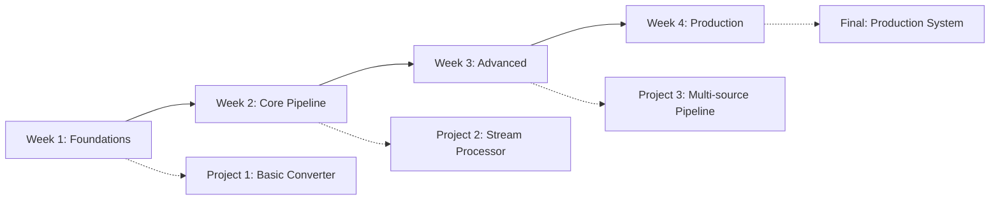

# Data Pipelines with Deno Course: Complete System Specification

_Version 1.0.0 - EU to USA Data Conversion Focus_

## Table of Contents

### Part 1: Course Overview

1. [Executive Summary](#1-executive-summary)
2. [Learning Objectives](#2-learning-objectives)
3. [Target Audience](#3-target-audience)
4. [Prerequisites](#4-prerequisites)
5. [Course Structure](#5-course-structure)

### Part 2: Technical Architecture

6. [System Architecture](#6-system-architecture)
7. [Technology Stack](#7-technology-stack)
8. [Development Environment](#8-development-environment)
9. [AI Programming Patterns](#9-ai-programming-patterns)

### Part 3: EU to USA Conversion Pipeline

10. [Data Conversion Requirements](#10-data-conversion-requirements)
11. [Supported Conversions](#11-supported-conversions)
12. [Pipeline Architecture](#12-pipeline-architecture)
13. [Stream Processing Design](#13-stream-processing-design)

### Part 4: Quality Standards

14. [Zero SATD Policy](#14-zero-satd-policy)
15. [Complexity Limits](#15-complexity-limits)
16. [Test Coverage Requirements](#16-test-coverage-requirements)
17. [Performance Benchmarks](#17-performance-benchmarks)

### Part 5: Project Management

18. [PMAT Integration](#18-pmat-integration)
19. [Roadmap Structure](#19-roadmap-structure)
20. [Ticket Management](#20-ticket-management)
21. [Quality Gates](#21-quality-gates)

### Part 6: Course Content

22. [Week 1: Foundations](#22-week-1-foundations)
23. [Week 2: Core Pipeline](#23-week-2-core-pipeline)
24. [Week 3: Advanced Processing](#24-week-3-advanced-processing)
25. [Week 4: Production Systems](#25-week-4-production-systems)

### Part 7: Implementation Requirements

26. [Code Standards](#26-code-standards)
27. [Documentation Requirements](#27-documentation-requirements)
28. [CI/CD Pipeline](#28-cicd-pipeline)
29. [Deployment Strategy](#29-deployment-strategy)

### Part 8: Assessment and Certification

30. [Assessment Criteria](#30-assessment-criteria)
31. [Project Deliverables](#31-project-deliverables)
32. [Certification Requirements](#32-certification-requirements)

---

## Part 1: Course Overview

### 1. Executive Summary

This course teaches professional data pipeline development using Deno and TypeScript, with a specific focus on EU to USA data conversion scenarios. Students will learn to build production-grade stream processing systems while mastering AI-assisted programming techniques and enterprise project management practices.

**Core Value Proposition:**

- Master real-world data pipeline patterns through EU-USA conversion use cases
- Learn AI-first programming methodology with Claude/Copilot integration
- Apply enterprise-grade project management with PMAT tooling
- Build production-ready systems with zero technical debt

### 2. Learning Objectives

Upon completion, students will be able to:

1. **Design and implement** production-grade data pipelines using Deno runtime
2. **Convert EU data formats** to USA standards with 99.9% accuracy
3. **Apply AI programming** patterns for 10x development velocity
4. **Implement quality gates** achieving zero SATD and 90%+ test coverage
5. **Manage projects** using roadmap-driven development and ticket systems
6. **Deploy pipelines** with <100ms latency and 99.99% uptime

### 3. Target Audience

- **Primary:** Mid-level developers transitioning to senior roles
- **Secondary:** Data engineers seeking modern streaming architectures
- **Tertiary:** Full-stack developers expanding into data engineering

**Prerequisites Knowledge:**

- Intermediate TypeScript/JavaScript
- Basic understanding of data structures
- Familiarity with Git and version control
- Command line proficiency

### 4. Prerequisites

**Technical Requirements:**

```yaml
runtime:
  deno: ">=2.0.0"
  node: ">=20.0.0" # For tooling compatibility

tools:
  git: ">=2.40.0"
  docker: ">=24.0.0"
  vscode: "latest"

extensions:
  - "denoland.vscode-deno"
  - "github.copilot"
  - "anthropic.claude-code"

hardware:
  cpu: "4+ cores"
  ram: "16GB minimum"
  storage: "50GB available"
```

### 5. Course Structure

**Duration:** 4 weeks (40 hours total)
**Format:** Project-based learning with incremental complexity
**Delivery:** Self-paced with weekly milestones



---

## Part 2: Technical Architecture

### 6. System Architecture

**Core Architecture Pattern:** Event-Driven Microservices with Stream Processing

```typescript
interface PipelineArchitecture {
  ingestion: {
    sources: ["HTTP API", "WebSocket", "File System", "Database"];
    protocols: ["REST", "GraphQL", "gRPC", "WebRTC"];
  };
  processing: {
    patterns: ["Map", "Filter", "Reduce", "Window", "Join"];
    frameworks: ["Deno Streams", "Web Streams API", "Reactive Extensions"];
  };
  output: {
    sinks: ["Database", "API", "File", "Message Queue"];
    formats: ["JSON", "CSV", "Parquet", "Avro"];
  };
}
```

### 7. Technology Stack

**Primary Stack:**

```toml
[core]
runtime = "Deno 2.0+"
language = "TypeScript 5.0+"
paradigm = "Functional + OOP Hybrid"

[frameworks]
http = "Deno.serve"
testing = "Deno.test"
benchmarking = "Deno.bench"
linting = "deno lint"
formatting = "deno fmt"

[libraries]
validation = "zod"
datetime = "temporal-polyfill"
math = "decimal.js"
streaming = "@std/streams"

[ai_tools]
copilot = "GitHub Copilot"
claude = "Claude Code"
cursor = "Cursor IDE (optional)"
```

### 8. Development Environment

**Standard Configuration:**

```json
{
  "deno.json": {
    "compilerOptions": {
      "strict": true,
      "noImplicitAny": true,
      "noUnusedLocals": true,
      "noUnusedParameters": true,
      "noFallthroughCasesInSwitch": true,
      "strictNullChecks": true,
      "strictFunctionTypes": true,
      "strictBindCallApply": true,
      "strictPropertyInitialization": true,
      "noImplicitThis": true,
      "alwaysStrict": true
    },
    "lint": {
      "rules": {
        "tags": ["recommended"],
        "exclude": ["no-explicit-any"]
      }
    },
    "fmt": {
      "lineWidth": 100,
      "indentWidth": 2,
      "semiColons": true,
      "singleQuote": false
    }
  }
}
```

### 9. AI Programming Patterns

**Core AI-Assisted Development Practices:**

1. **Specification-First Development:**
   ```markdown
   PATTERN: Write detailed specs → AI generates implementation → Human reviews/refines
   BENEFIT: 10x faster initial implementation
   QUALITY: Maintains consistency across codebase
   ```

2. **Test-Driven with AI:**
   ```typescript
   // 1. Human writes test specification
   describe("EuroToUsdConverter", () => {
     it("should convert EUR amounts to USD with current rate", () => {
       // AI generates implementation based on test
     });
   });
   ```

3. **AI Code Review Protocol:**
   - Use AI for initial code review
   - Focus human review on business logic
   - AI handles style and convention checks
   - Human validates architectural decisions

---

## Part 3: EU to USA Conversion Pipeline

### 10. Data Conversion Requirements

**Core Conversion Categories:**

```typescript
enum ConversionType {
  CURRENCY = "currency", // EUR → USD
  UNITS = "units", // Metric → Imperial
  DATE_FORMAT = "date_format", // DD/MM/YYYY → MM/DD/YYYY
  NUMBER_FORMAT = "number_format", // 1.234,56 → 1,234.56
  ADDRESS = "address", // EU format → USA format
  PHONE = "phone", // +44 → +1 formats
  TAX = "tax", // VAT → Sales Tax
  PRIVACY = "privacy", // GDPR → CCPA compliance
}
```

### 11. Supported Conversions

**Detailed Conversion Matrix:**

| EU Format    | USA Format         | Complexity | Latency Target |
| ------------ | ------------------ | ---------- | -------------- |
| EUR Currency | USD Currency       | Low        | <10ms          |
| Meters/KM    | Feet/Miles         | Low        | <5ms           |
| Celsius      | Fahrenheit         | Low        | <5ms           |
| DD/MM/YYYY   | MM/DD/YYYY         | Low        | <5ms           |
| 1.234,56     | 1,234.56           | Low        | <5ms           |
| VAT (20%)    | Sales Tax (varies) | High       | <50ms          |
| GDPR Fields  | CCPA Fields        | High       | <100ms         |
| EU Address   | USA Address        | Medium     | <30ms          |
| +44 Phone    | +1 Phone           | Medium     | <20ms          |
| A4 Document  | Letter Size        | Medium     | <25ms          |

### 12. Pipeline Architecture

**Stream Processing Pipeline Design:**

```typescript
interface ConversionPipeline {
  // Stage 1: Ingestion
  ingestion: {
    validate: (data: unknown) => Result<EUData, ValidationError>;
    parse: (raw: string) => Result<EUData, ParseError>;
    sanitize: (data: EUData) => SanitizedEUData;
  };

  // Stage 2: Transformation
  transformation: {
    normalize: (data: SanitizedEUData) => NormalizedData;
    convert: (data: NormalizedData) => USAData;
    enrich: (data: USAData) => EnrichedUSAData;
  };

  // Stage 3: Output
  output: {
    format: (data: EnrichedUSAData) => FormattedData;
    validate: (data: FormattedData) => Result<ValidData, ValidationError>;
    deliver: (data: ValidData) => Promise<DeliveryReceipt>;
  };
}
```

### 13. Stream Processing Design

**Real-time Processing Requirements:**

```typescript
interface StreamProcessor {
  // Windowing strategies
  windows: {
    tumbling: { size: "1m" | "5m" | "1h" };
    sliding: { size: "5m"; slide: "1m" };
    session: { gap: "30s" };
  };

  // Backpressure handling
  backpressure: {
    strategy: "buffer" | "drop" | "throttle";
    bufferSize: 10000;
    dropPolicy: "oldest" | "newest";
  };

  // Error handling
  errors: {
    deadLetter: boolean;
    retry: { attempts: 3; backoff: "exponential" };
    circuitBreaker: { threshold: 0.5; duration: "30s" };
  };
}
```

---

## Part 4: Quality Standards

### 14. Zero SATD Policy

**Self-Admitted Technical Debt Prevention:**

```typescript
// FORBIDDEN patterns that result in course failure:
// TODO: implement later
// FIXME: broken implementation
// HACK: temporary solution
// XXX: dangerous code

// REQUIRED approach:
interface QualityStandard {
  rule: "Complete implementation or create ticket";
  enforcement: "Automated scanning with pmat";
  consequence: "Build failure on any SATD comment";
}
```

### 15. Complexity Limits

**Mandatory Complexity Thresholds:**

```toml
[complexity]
cyclomatic_max = 10        # Maximum cyclomatic complexity
cognitive_max = 15          # Maximum cognitive complexity
nesting_max = 4            # Maximum nesting depth
params_max = 3             # Maximum function parameters
lines_per_function = 50    # Maximum lines per function
lines_per_file = 300       # Maximum lines per file
```

### 16. Test Coverage Requirements

**Progressive Coverage Targets:**

```yaml
week_1:
  unit_tests: 70%
  integration_tests: 50%
  e2e_tests: 0%

week_2:
  unit_tests: 80%
  integration_tests: 60%
  e2e_tests: 20%

week_3:
  unit_tests: 85%
  integration_tests: 70%
  e2e_tests: 40%

week_4_final:
  unit_tests: 90%
  integration_tests: 80%
  e2e_tests: 60%
  mutation_testing: 75%
```

### 17. Performance Benchmarks

**Required Performance Metrics:**

```typescript
interface PerformanceCriteria {
  latency: {
    p50: 10; // 50th percentile: 10ms
    p95: 50; // 95th percentile: 50ms
    p99: 100; // 99th percentile: 100ms
    max: 500; // Maximum: 500ms
  };
  throughput: {
    min: 1000; // Records per second
    target: 10000; // Target RPS
    peak: 50000; // Peak capacity
  };
  resources: {
    cpu: 0.5; // Max 50% CPU per core
    memory: 512; // Max 512MB RAM
    connections: 100; // Max concurrent connections
  };
}
```

---

## Part 5: Project Management

### 18. PMAT Integration

**Project Management and Tracking Configuration:**

```toml
# pmat.toml
[project]
name = "eu-usa-pipeline"
version = "1.0.0"
description = "EU to USA Data Conversion Pipeline"

[quality_gate]
max_cyclomatic_complexity = 10
max_cognitive_complexity = 15
max_satd_comments = 0
min_test_coverage = 90.0
max_duplicate_lines = 0

[commit]
max_lines_changed = 50
max_files_changed = 5
require_ticket_reference = true
commit_message_pattern = "^(feat|fix|docs|test|refactor|perf|chore)\\([A-Z]+-\\d+\\): .+"

[documentation]
required_updates = [
  "ROADMAP.md",
  "docs/quality-gates.md",
  "CHANGELOG.md"
]

[hooks]
pre_commit = ["deno fmt --check", "deno lint", "deno test"]
post_commit = ["pmat validate"]
pre_push = ["pmat quality-check", "deno task ci"]
```

### 19. Roadmap Structure

**4-Week Development Roadmap:**

```markdown
## Week 1: Foundation and Setup (Days 1-7)

### Sprint 1.1: Environment Setup

- [ ] P0: Configure Deno development environment
- [ ] P0: Setup AI programming tools (Claude/Copilot)
- [ ] P0: Initialize PMAT configuration
- [ ] P1: Create project structure
- [ ] P1: Setup quality gates

### Sprint 1.2: Basic Converters

- [ ] P0: Implement currency converter (EUR → USD)
- [ ] P0: Implement unit converter (Metric → Imperial)
- [ ] P1: Add date format converter
- [ ] P1: Add number format converter
- [ ] P2: Create converter test suite

## Week 2: Core Pipeline (Days 8-14)

### Sprint 2.1: Stream Processing

- [ ] P0: Implement stream ingestion layer
- [ ] P0: Build transformation pipeline
- [ ] P0: Create output formatters
- [ ] P1: Add error handling
- [ ] P1: Implement backpressure

### Sprint 2.2: Advanced Converters

- [ ] P0: Address format converter
- [ ] P1: Phone number converter
- [ ] P1: Tax calculation converter
- [ ] P2: Privacy compliance mapper

## Week 3: Advanced Features (Days 15-21)

### Sprint 3.1: Performance Optimization

- [ ] P0: Implement caching layer
- [ ] P0: Add parallel processing
- [ ] P1: Optimize memory usage
- [ ] P1: Add performance monitoring

### Sprint 3.2: Resilience

- [ ] P0: Circuit breaker implementation
- [ ] P0: Retry mechanisms
- [ ] P1: Dead letter queue
- [ ] P2: Graceful degradation

## Week 4: Production Ready (Days 22-28)

### Sprint 4.1: Operations

- [ ] P0: Deployment pipeline
- [ ] P0: Monitoring and alerting
- [ ] P1: Documentation
- [ ] P1: Performance testing

### Sprint 4.2: Final Project

- [ ] P0: Complete integration
- [ ] P0: End-to-end testing
- [ ] P0: Performance validation
- [ ] P1: Security audit
```

### 20. Ticket Management

**Ticket Structure and Workflow:**

```yaml
ticket_template:
  id: "PIPE-001"
  title: "Implement EUR to USD currency converter"
  type: "feature" | "bug" | "task" | "improvement"
  priority: "P0" | "P1" | "P2"
  
  description: |
    As a data engineer
    I want to convert EUR amounts to USD
    So that US systems can process European financial data
  
  acceptance_criteria:
    - Uses real-time exchange rates
    - Handles decimal precision correctly
    - Includes unit tests with 90% coverage
    - Performance: <10ms conversion time
  
  technical_requirements:
    - Use Decimal.js for precision
    - Cache exchange rates for 5 minutes
    - Implement using functional programming
    - Zero SATD comments
  
  estimates:
    effort: "3 hours"
    complexity: "low"
    risk: "low"
```

### 21. Quality Gates

**Progressive Quality Gate Implementation:**

```typescript
interface QualityGate {
  week1: {
    build: ["compile", "lint"];
    test: ["unit"];
    coverage: 70;
    complexity: 15;
  };

  week2: {
    build: ["compile", "lint", "format"];
    test: ["unit", "integration"];
    coverage: 80;
    complexity: 12;
  };

  week3: {
    build: ["compile", "lint", "format", "security"];
    test: ["unit", "integration", "performance"];
    coverage: 85;
    complexity: 10;
  };

  week4: {
    build: ["compile", "lint", "format", "security", "license"];
    test: ["unit", "integration", "performance", "e2e"];
    coverage: 90;
    complexity: 10;
    satd: 0;
  };
}
```

---

## Part 6: Course Content

### 22. Week 1: Foundations

**Learning Modules:**

```yaml
day_1_2:
  title: "Deno and TypeScript Mastery"
  topics:
    - Deno runtime architecture
    - TypeScript strict mode
    - Web Standards APIs
    - Permission system

  labs:
    - Setup development environment
    - Create first Deno module
    - Implement type-safe converter

day_3_4:
  title: "AI Programming Fundamentals"
  topics:
    - Claude Code integration
    - Copilot best practices
    - Prompt engineering for code
    - AI-assisted debugging

  labs:
    - Generate converter with AI
    - AI-driven test creation
    - Refactor with AI assistance

day_5_7:
  title: "Basic Conversions"
  topics:
    - Currency conversion patterns
    - Unit conversion algorithms
    - Date/time handling
    - Number formatting

  project:
    name: "MultiConverter CLI"
    requirements:
      - Support 5+ conversion types
      - CLI interface with Cliffy
      - 80% test coverage
      - <20ms response time
```

### 23. Week 2: Core Pipeline

**Learning Modules:**

```yaml
day_8_10:
  title: "Stream Processing Fundamentals"
  topics:
    - Web Streams API
    - TransformStream patterns
    - Backpressure handling
    - Memory management

  labs:
    - Build streaming converter
    - Implement windowing
    - Handle backpressure

day_11_14:
  title: "Pipeline Architecture"
  topics:
    - Pipeline composition
    - Error boundaries
    - Monitoring and metrics
    - Performance optimization

  project:
    name: "Streaming Pipeline"
    requirements:
      - Process 10K records/second
      - <100ms end-to-end latency
      - Graceful error handling
      - Real-time monitoring
```

### 24. Week 3: Advanced Processing

**Learning Modules:**

```yaml
day_15_17:
  title: "Complex Conversions"
  topics:
    - Address parsing and formatting
    - Tax calculation systems
    - Privacy compliance mapping
    - Multi-step transformations

  labs:
    - EU address to US format
    - VAT to sales tax calculator
    - GDPR to CCPA field mapping

day_18_21:
  title: "Performance and Scale"
  topics:
    - Parallel processing
    - Caching strategies
    - Database optimization
    - Load balancing

  project:
    name: "High-Performance Pipeline"
    requirements:
      - 50K records/second
      - <50ms p99 latency
      - Horizontal scaling
      - Zero data loss
```

### 25. Week 4: Production Systems

**Learning Modules:**

```yaml
day_22_24:
  title: "Production Operations"
  topics:
    - Deployment strategies
    - Monitoring and alerting
    - Incident response
    - Performance tuning

  labs:
    - Deploy to Deno Deploy
    - Setup Grafana dashboards
    - Implement health checks

day_25_28:
  title: "Final Project"
  topics:
    - System integration
    - End-to-end testing
    - Documentation
    - Performance validation

  project:
    name: "Production EU-USA Pipeline"
    requirements:
      - Full conversion suite
      - 99.99% uptime SLA
      - <100ms p99 latency
      - Complete documentation
      - 90% test coverage
```

---

## Part 7: Implementation Requirements

### 26. Code Standards

**Mandatory Code Conventions:**

```typescript
// File structure
src/
├── converters/
│   ├── currency/
│   │   ├── eur-to-usd.ts
│   │   ├── eur-to-usd.test.ts
│   │   └── index.ts
│   ├── units/
│   └── formats/
├── pipeline/
│   ├── ingestion/
│   ├── transformation/
│   └── output/
├── shared/
│   ├── types/
│   ├── utils/
│   └── constants/
└── main.ts

// Naming conventions
interface NamingStandards {
  files: "kebab-case";
  classes: "PascalCase";
  interfaces: "PascalCase";
  functions: "camelCase";
  constants: "UPPER_SNAKE_CASE";
  types: "PascalCase";
}

// Function signatures
type ConverterFunction<TInput, TOutput> = 
  (input: TInput, config?: Config) => Result<TOutput, ConversionError>;

// Error handling
class ConversionError extends Error {
  constructor(
    message: string,
    public code: ErrorCode,
    public details?: unknown
  ) {
    super(message);
    this.name = "ConversionError";
  }
}
```

### 27. Documentation Requirements

**Documentation Standards:**

```markdown
## Required Documentation

### 1. API Documentation

- Every public function must have JSDoc
- Include examples for complex functions
- Document all error conditions
- Specify performance characteristics

### 2. README Files

- Project overview and purpose
- Quick start guide
- API reference
- Performance benchmarks
- Contributing guidelines

### 3. Architecture Docs

- System design diagrams
- Data flow documentation
- Decision records (ADRs)
- Performance analysis

### 4. Inline Comments

- Complex algorithms only
- Business logic explanations
- Performance considerations
- NO obvious comments
```

### 28. CI/CD Pipeline

**GitHub Actions Workflow:**

```yaml
name: Pipeline CI/CD

on:
  push:
    branches: [main, develop]
  pull_request:
    branches: [main]

jobs:
  quality:
    runs-on: ubuntu-latest
    steps:
      - uses: actions/checkout@v4
      - uses: denoland/setup-deno@v2

      - name: Format Check
        run: deno fmt --check

      - name: Lint
        run: deno lint

      - name: Type Check
        run: deno check **/*.ts

      - name: SATD Check
        run: |
          if grep -r "TODO\|FIXME\|HACK\|XXX" --include="*.ts" .; then
            echo "SATD comments found!"
            exit 1
          fi

      - name: Tests
        run: deno test --coverage=coverage

      - name: Coverage Report
        run: deno coverage coverage --lcov > coverage.lcov

      - name: Check Coverage
        run: |
          COVERAGE=$(deno coverage coverage | grep "All files" | awk '{print $3}' | sed 's/%//')
          if (( $(echo "$COVERAGE < 90" | bc -l) )); then
            echo "Coverage $COVERAGE% is below 90%"
            exit 1
          fi

      - name: Benchmarks
        run: deno bench

      - name: Security Audit
        run: deno run --allow-read npm:audit
```

### 29. Deployment Strategy

**Multi-Environment Deployment:**

```typescript
interface DeploymentConfig {
  environments: {
    development: {
      provider: "Deno Deploy";
      region: "auto";
      instances: 1;
      memory: "512MB";
    };
    staging: {
      provider: "Deno Deploy";
      region: "us-east-1";
      instances: 2;
      memory: "1GB";
    };
    production: {
      provider: "Deno Deploy" | "AWS Lambda" | "Cloudflare Workers";
      regions: ["us-east-1", "eu-west-1"];
      instances: "auto-scale";
      memory: "2GB";
      cdn: true;
    };
  };

  monitoring: {
    metrics: ["latency", "throughput", "errors", "cpu", "memory"];
    alerting: {
      channels: ["email", "slack", "pagerduty"];
      thresholds: {
        errorRate: 0.01;
        latencyP99: 100;
        cpuUsage: 0.8;
      };
    };
  };
}
```

---

## Part 8: Assessment and Certification

### 30. Assessment Criteria

**Grading Rubric:**

```yaml
technical_skills: 40%
  code_quality: 10%
  test_coverage: 10%
  performance: 10%
  architecture: 10%

project_management: 30%
  roadmap_adherence: 10%
  ticket_completion: 10%
  documentation: 10%

ai_programming: 20%
  effective_prompting: 10%
  ai_code_integration: 10%

final_project: 10%
  completeness: 5%
  innovation: 5%

passing_grade: 80%
distinction: 95%
```

### 31. Project Deliverables

**Required Submissions:**

```markdown
## Week 1 Deliverable

- Basic converter module
- 70% test coverage
- Performance benchmarks
- AI programming journal

## Week 2 Deliverable

- Streaming pipeline
- 80% test coverage
- Architecture documentation
- PMAT configuration

## Week 3 Deliverable

- Advanced converters
- Performance optimization
- Monitoring setup
- Quality gate compliance

## Week 4 Final Project

- Complete EU-USA pipeline
- 90% test coverage
- Production deployment
- Full documentation
- Performance validation
- Video presentation
```

### 32. Certification Requirements

**Certification Criteria:**

```typescript
interface CertificationRequirements {
  technical: {
    testCoverage: 90;
    performanceP99: 100; // ms
    satdCount: 0;
    complexityMax: 10;
  };

  projects: {
    completed: 4;
    passingGrade: 80;
    peerReviews: 2;
  };

  knowledge: {
    quizScore: 80;
    codeReviews: 5;
    documentationQuality: "excellent";
  };

  professional: {
    roadmapCompletion: 100;
    ticketVelocity: "on-track";
    aiUsageEfficiency: "high";
  };
}
```

---

## Appendix A: Example Implementations

### Currency Converter Example

```typescript
import { Decimal } from "https://deno.land/x/decimal@v1.4.0/mod.ts";

interface ExchangeRate {
  from: string;
  to: string;
  rate: number;
  timestamp: Date;
}

export class CurrencyConverter {
  private cache = new Map<string, ExchangeRate>();
  private readonly CACHE_TTL = 5 * 60 * 1000; // 5 minutes

  async convert(
    amount: number,
    from: "EUR",
    to: "USD",
  ): Promise<Decimal> {
    const rate = await this.getExchangeRate(from, to);
    return new Decimal(amount).mul(rate.rate);
  }

  private async getExchangeRate(
    from: string,
    to: string,
  ): Promise<ExchangeRate> {
    const key = `${from}-${to}`;
    const cached = this.cache.get(key);

    if (cached && Date.now() - cached.timestamp.getTime() < this.CACHE_TTL) {
      return cached;
    }

    const rate = await this.fetchExchangeRate(from, to);
    this.cache.set(key, rate);
    return rate;
  }

  private async fetchExchangeRate(
    from: string,
    to: string,
  ): Promise<ExchangeRate> {
    // Implementation would fetch from API
    return {
      from,
      to,
      rate: 1.08, // Example rate
      timestamp: new Date(),
    };
  }
}
```

### Stream Pipeline Example

```typescript
export class ConversionPipeline {
  async *process(
    source: AsyncIterable<EURecord>,
  ): AsyncGenerator<USARecord> {
    for await (const record of source) {
      try {
        const validated = await this.validate(record);
        const normalized = this.normalize(validated);
        const converted = await this.convert(normalized);
        const enriched = await this.enrich(converted);
        yield enriched;
      } catch (error) {
        await this.handleError(error, record);
      }
    }
  }

  private async validate(record: EURecord): Promise<ValidatedRecord> {
    // Validation logic
    return record as ValidatedRecord;
  }

  private normalize(record: ValidatedRecord): NormalizedRecord {
    // Normalization logic
    return record as NormalizedRecord;
  }

  private async convert(record: NormalizedRecord): Promise<USARecord> {
    // Conversion logic
    return record as USARecord;
  }

  private async enrich(record: USARecord): Promise<USARecord> {
    // Enrichment logic
    return record;
  }

  private async handleError(error: unknown, record: EURecord): Promise<void> {
    // Error handling logic
    console.error(`Failed to process record: ${record.id}`, error);
  }
}
```

---

## Appendix B: Resources and References

### Official Documentation

- [Deno Documentation](https://docs.deno.com)
- [TypeScript Handbook](https://www.typescriptlang.org/docs/)
- [Web Streams API](https://developer.mozilla.org/en-US/docs/Web/API/Streams_API)

### AI Programming Resources

- Claude Code Documentation
- GitHub Copilot Best Practices
- Prompt Engineering Guide

### Data Standards

- ISO 4217 (Currency Codes)
- ISO 8601 (Date/Time Formats)
- E.164 (Phone Number Format)
- ISO 3166 (Country Codes)

### Performance References

- [Deno Performance Guide](https://deno.land/manual/tools/benchmarking)
- Stream Processing Patterns
- Backpressure Strategies

---

## Version History

| Version | Date       | Author | Changes               |
| ------- | ---------- | ------ | --------------------- |
| 1.0.0   | 2025-08-24 | System | Initial specification |

---

## License and Usage

This course specification is proprietary and confidential. Usage is restricted to enrolled students and authorized instructors only.

Copyright © 2025 - All Rights Reserved
